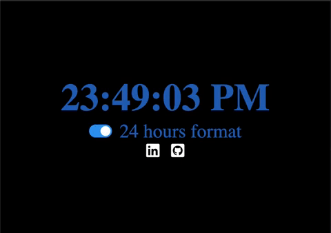
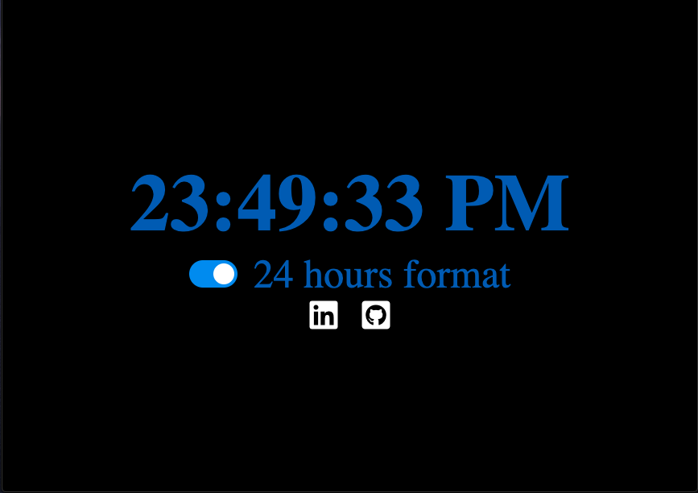

# Digital Clock

A Digital clock with options for 24 hour or 12 hour format

## Motivation

I want to build 30 Projects in 30 Days as a challenge.

## Screenshots

## Showcase

## Landing Page:

Homepage

## Built With

### Front-End

- HTML
- CSS
- JavaScript
  -localStorage

## Features

- Set prefered format for time 12/24 hours
- Format selected will be saved on localStorage

## Demo

- [Live Demo](https://aneudya4.github.io/digital-clock/)

## Authors

**Aneudy Adames** - \*\* - Front-End development
